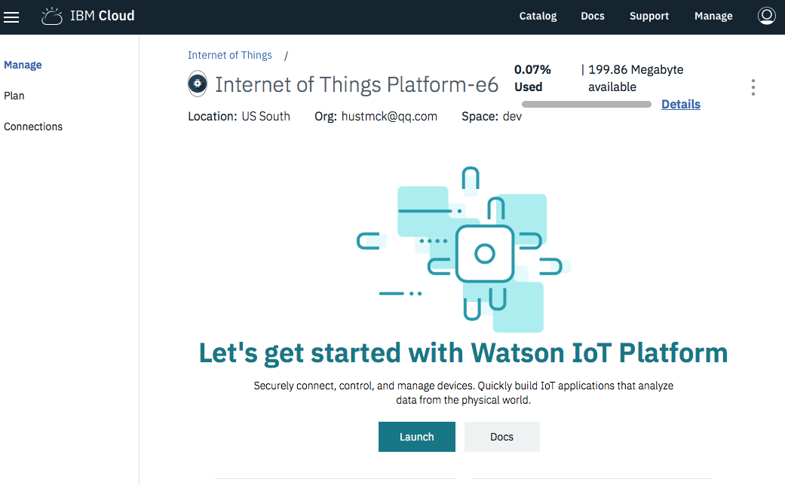
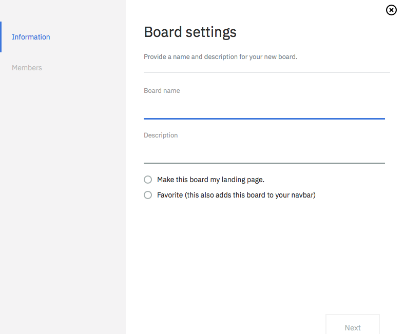
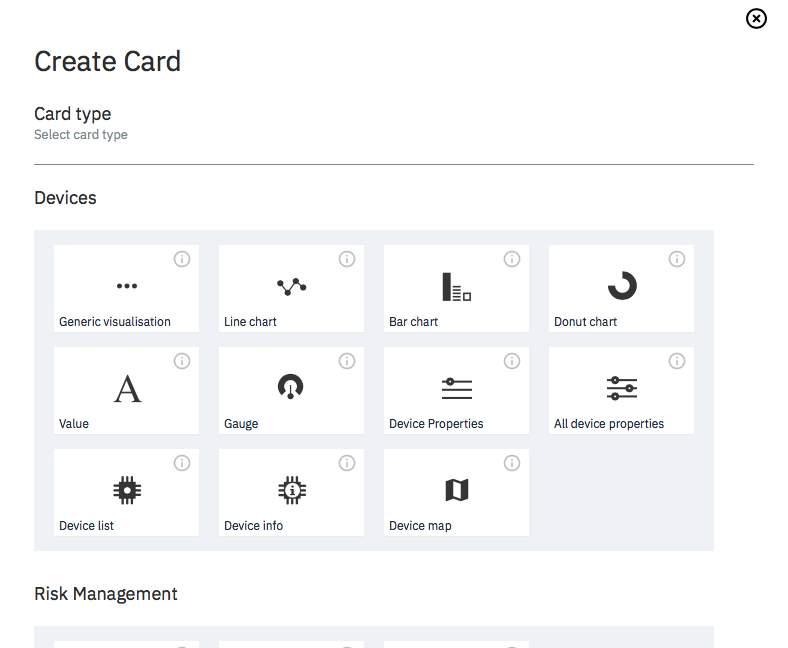
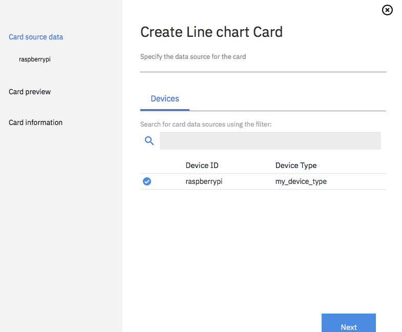
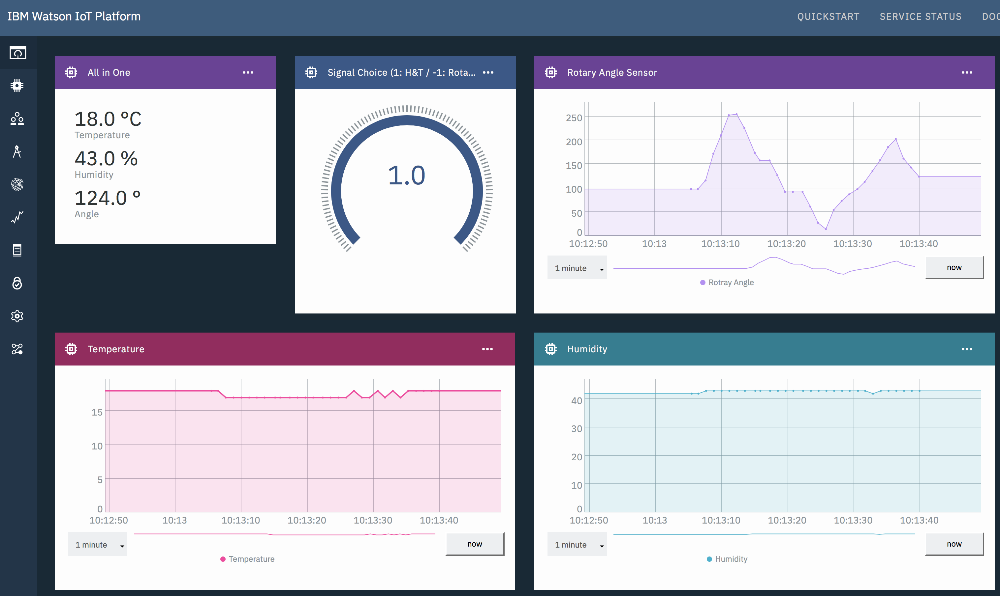

# ISCG8052 The Internet of Things
## Internet of Thing System over the Cloud - (AS1)
> Name | ID | Email
> ---|---|---
> Chunkai Meng| 1494933 | willcute@gmail.com
> Feng Gao | 1490190 | gaofeng816@gmail.com
> Long He | 1494150 | qmqd1225@gmail.com

### Aim
Develop an Internet of Things system over the Cloud. You should set up an IoT gateway on a Raspberry Pi (rPi) and use an IoT broker on a PaaS (Platform as a Service) Cloud System (Either IBM, Google, Amazon or Microsoft Cloud Systems). Configure the Raspberry Pi to send data to the Cloud and to receive data from it. The system will read data from the environment using the Grove Pi or Sense Hat sensors and
publish/subscribe them over MQTT Topics. A security framework should be included using SSL/TLS.

## Usage
### Preparation
#### Setting up Raspberry Pi
+ Connect the Pi to screen, keyboard, mouse.
+ Connect the microUSB port to USB Power adapter.
+ After power up, check the Pi's IP address.
```
ifconfig
# or
hostname -I
```

#### Connect to GrovePi
> Refer to: [Quick Start Guide to the GrovePi.](https://www.dexterindustries.com/GrovePi/get-started-with-the-grovepi/)

1. Connect the GrovePi to Raspberry Pi


2. Install the GrovePi repository
```
curl -kL dexterindustries.com/update_grovepi | sudo bash
```

3. Check if Raspberrypi has connected to Grovepi
```
sudo i2cdetect -y 1
```

4. Connect ******* to port ********

#### Setting up development environment Pi
+ Download the latest code from github
```
git clone https://github.com/chunkai-meng/IoT.git
```

+ Or copy the code to Pi
```
# Open a terminal connect to Pi
ssh -t pi@<ip> "cd ~/AS1/PubSub; bash"
# Open another terminal upload code to Pi
cd <PubSub's Parent Directory>
scp -r PubSub pi@<ip>:~/AS1/PubSub
```
+ Install the latest version of the Python library for IBM Watson IoT Platform
```
[root@localhost ~]# pip install ibmiotf
```

### Setting up IBM IoT Cloud

#### Login IBM IoT Cloud and launch your IoT Platform



#### Setup device and API

+ Create a device on the cloud
    - Follow this [link](https://console.bluemix.net/docs/services/IoT/iotplatform_task.html#iotplatform_task)
+ Create API keys and tokens
    - These will be used by our 'Sub.py' application to subscribe topic from IBM IoT cloud.
    - Follow this [link](https://console.bluemix.net/docs/services/IoT/platform_authorization.html#connecting-applications)
+

#### Setup Dashboard

- Create New Board


- Create a New Card
    
    - Choose Line Chart for temperature and other sensors' data virtualisation
    - Choose Value Chart for button selection virtualisation

- Select the Card Source


- Run `Pub.py` in the terminal that connected to Pi
```
python ~/AS1/Pub.py
```
    - **Optional:** You can edit `Pub.py` to change the event name or the number of message sent to the cloud.
    ```py
    event = "event"
    nummsgs = 20            # number of message to send
    sensorChoice = 1        # Defualt of Choice: 1: Temperature & Humidity;  -1: Rotary Angle
    ```

- Go to the new Board
    - You will see the sensor details on Dashboard.
    

- Run `Sub.py` in another terminal that connected to Pi
```
python ~/AS1/Sub.py
```
    - You will see some output showing the received messages
    - Also you will see the output shown on the Display.
